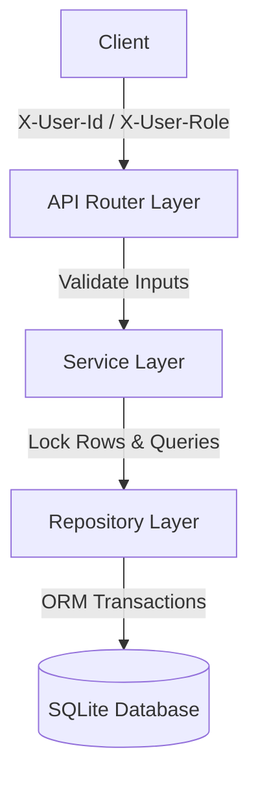
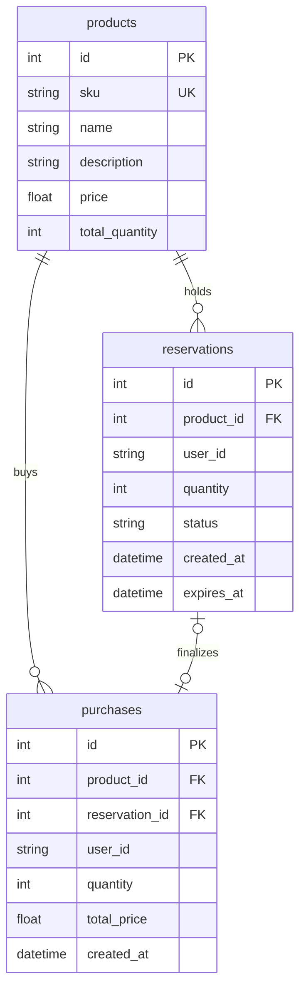

# Inventory Reservation & Purchase Backend

A modular, concurrency-safe Python backend for managing product cataloging, temporary stock holds (reservations), and final sales (purchases). Built using **FastAPI**, **SQLAlchemy**, **SQLite**, and **Pydantic V2**.

---

## 1. Setup Instructions

### Prerequisites
- Python 3.10 or higher installed.

### Installation Steps
1. **Navigate to the workspace**:
   ```bash
   cd c:\Users\karur\trimble
   ```
2. **Install all required dependencies**:
   ```bash
   pip install -r requirements.txt
   ```
3. **Start the development server** (auto-reload enabled):
   ```bash
   uvicorn app.main:app --reload
   ```
4. **Access Interactive Swagger Documentation**:
   - URL: http://127.0.0.1:8000/docs

---

## 2. Architecture & Design

The project strictly follows the **Single Responsibility Principle (SRP)** and is partitioned into decoupled, modular layers:

- **API Router Layer** (`app/routers/`): Validates path parameters using `Path(..., gt=0)`, injects authorization headers, coordinates requests, and formats JSON responses.
- **Service Layer** (`app/services/`): Core business logic rules (evaluating dynamic stock levels, lifecycle transitions, transaction coordination). Completely decoupled from raw HTTP protocol details.
- **Repository Layer** (`app/repositories/`): Database access boundaries handling SQL filtering, locks, and retrieval.
- **Models Layer** (`app/models/`): SQLAlchemy declarative tables modeling core relational schemas.
- **Schemas Layer** (`app/schemas/`): Pydantic validation structures asserting boundary inputs (`gt=0`, `ge=0`) and serializing output payloads using V2 `model_config`.



---

## 3. Database Design

We use SQLite for persistence with foreign key constraints enabled.



- **Relationships**:
  - `Product` has many `Reservations` and `Purchases` (`ON DELETE CASCADE`).
  - `Reservation` transitions to at most one `Purchase`. `Purchase` references `Reservation` via unique index (`ON DELETE SET NULL`), preserving sales history even if holds are cleaned up.

---

## 4. Concurrency Strategy (Overselling Prevention)

To guarantee that simultaneous reservation requests for the same product never reserve more stock than is available, we implement a two-pronged lock strategy:

1. **Database-Agnostic Pessimistic Locking**:
   - During reservations and purchases, we fetch the product row using `product_repo.get_for_update(db, id)`, translating to `SELECT ... FOR UPDATE`.
   - In production databases (e.g. PostgreSQL/MySQL), this locks the target product row immediately. Any concurrent read/write transactions attempting to lock the same row block until the active transaction commits.
2. **SQLite Write Serialization**:
   - Because SQLite does not natively support row-level locks and defaults to deferred transactions (which causes write deadlocks under load), we register a connection listener on the SQLAlchemy engine targeting the `begin` event:
     ```python
     @event.listens_for(engine, "begin")
     def do_begin(conn):
         conn.exec_driver_sql("BEGIN IMMEDIATE")
     ```
   - This instantly acquires a write lock on the SQLite file database at the start of any write transaction, serializing requests at the connection layer and preventing overselling/upgrade conflicts.

---

## 5. API Overview & Expected Headers

All endpoints require authorization headers:
- `X-User-Id` (String): Owner identifier (e.g., `cust_123`, `admin_1`).
- `X-User-Role` (String): Role permission: `"admin"` or `"customer"`.

### Key Endpoints

| Resource | Method & Path | Headers | Description |
|---|---|---|---|
| **Products** | `POST /products/` | Admin | Create product catalog entry |
| | `GET /products/` | All | List catalog (includes dynamic `available_quantity` calculation) |
| | `PUT /products/{id}` | Admin | Edit product pricing or stock |
| | `DELETE /products/{id}` | Admin | Delete product |
| **Reservations** | `POST /reservations/` | All | Create a temporary stock hold |
| | `GET /reservations/` | All | List active holds (Customers only see their own) |
| | `POST /reservations/{id}/cancel` | All | Release hold (reverts stock to available immediately) |
| | `POST /reservations/cleanup` | Admin | Bulk expire stale reservations |
| **Purchases** | `POST /purchases/` | All | Finalize transaction (supports direct buy or from reservation) |

---

## 6. Testing Instructions

We use `pytest` and run tests against an isolated, temporary, file-based SQLite database (`test_inventory.db`) to enable multi-threaded execution.

Run the test suite:
```bash
python -m pytest
```

Included tests verify:
- Dynamic stock deductions and cascade deletes.
- Multi-threaded concurrency execution (using `ThreadPoolExecutor` simulating 10 parallel threads to ensure zero overselling).
- Access control guards (blocking customer A from reading/modifying customer B's holds).
- Request validation (negative stock, negative quantities, negative pricing).
- Consistent JSON error response payloads.

---

## 7. Key Design Decisions

- **Consistent JSON Error Formatting**:
  We registered global exception handlers in `app/main.py` catching custom business exceptions (`ResourceNotFoundException`, `InsufficientStockException`, `InvalidStateException`, `UnauthorizedAccessException`). Standard FastAPI validations are captured and mapped to a unified output format:
  ```json
  {
    "error_code": "INSUFFICIENT_STOCK",
    "message": "Insufficient stock for product ID 1."
  }
  ```
- **Consolidated Atomic Transactions**:
  The reservation-to-purchase flow operates inside a single, unified database transaction. Checks, reservation updates, stock deductions, and purchase insertions are performed on the ORM session and committed at the very end in a **single `db.commit()` call**, eliminating dirty writes and manual recovery rollbacks.
- **Dynamic Availability Calculation**:
  Available stock is computed dynamically: `total_quantity - sum(active_reservations)`. This avoids double-book keeping variables, ensuring consistency when holds expire on the fly.
